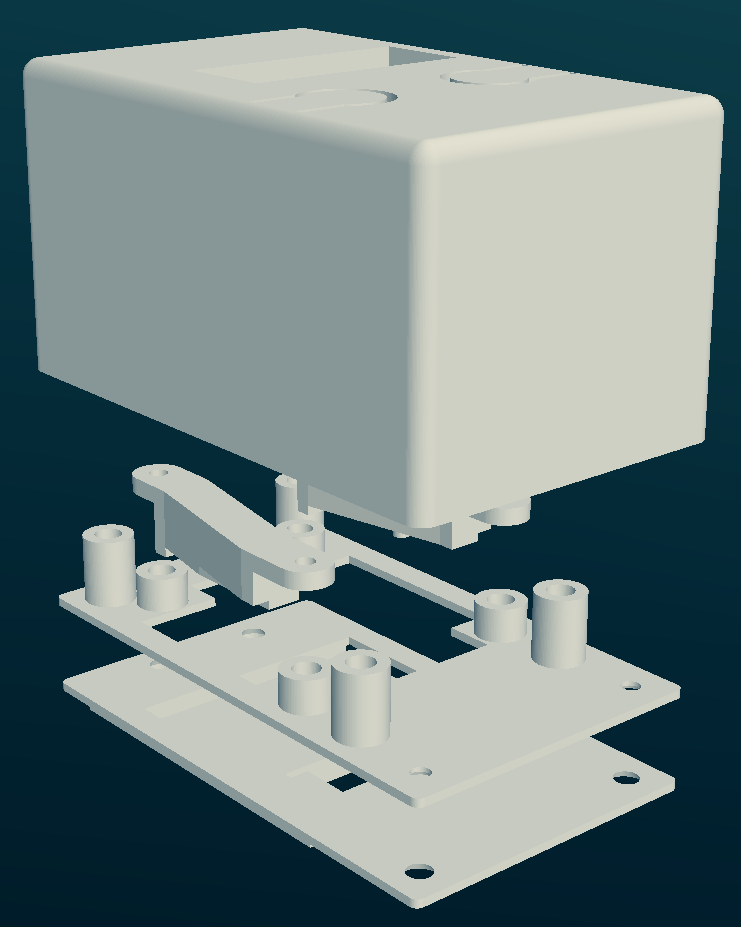

# Shell

## Files

- **basePlate.scad**: Contains the connector for the remote
- **carrierPlate.scad**: Mount for the connector pcb and main pcb. Can be glued to basePlate or just screwed together.
- **connectorCarrier.scad**: Bracket for the connector pcb.
- **main.scad**: Representation of all components.
- **shell.scad**: Outer shell of the enclosure.

## BOM

| Anzahl | Part                     | Note                        |
| ------ | ------------------------ | --------------------------- |
| 4      | threaded insert M2x4x3.5 | Used to close the enclosure |
| 12     | threaded insert M2x3x3.5 | Used to attach the pcbs     |
| 4      | countersunk screw M2x6mm | Used to close the enclosure |
| 12     | round head screw M2x5mm  | Used to attach the pcbs     |